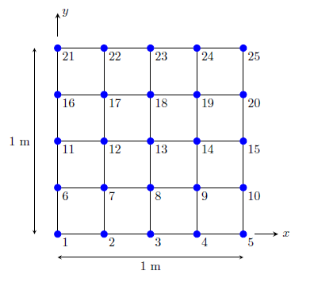
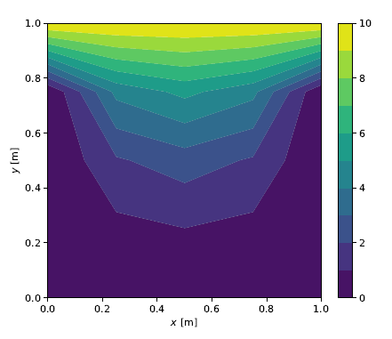
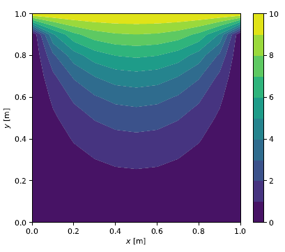
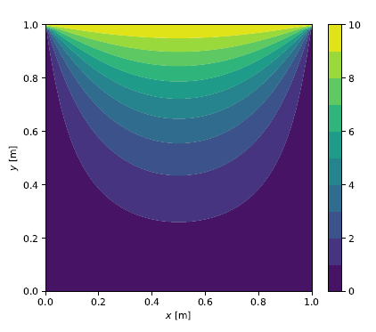
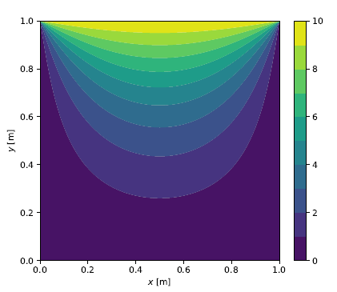

### **Governing Equation**

Steady-state groundwater flow in two-dimensions is governed by the differential equation

$$
k_x \frac{\partial^2 h}{\partial x^2} + k_y \frac{\partial^2 h}{\partial y^2} = Q
$$

where $$ k_x $$ and $$ k_y $$ are the hydraulic conductivities in the $$ x $$ and $$ y $$ directions, respectively,  $$ h $$ is the hydraulic head and $$ Q $$ represents source/sink in the flow domain. If the permeability is assumed to be isotropic, i.e. $$ k_x = k_y = k $$, and if source/sink terms are ignored in the flow domain, we get 

$$
\frac{\partial^2 h}{\partial x^2} + \frac{\partial^2 h}{\partial y^2} = 0
$$

which is a form of the well-know Laplace equation.

### **Spatial Discretization**

The first step is to spatially discretize the domain over which we aim to solve the problem and define the boundary conditions. A typical 2D discretization is shown in the figure below where the two-dimensional domain is discretized with a uniform grid mesh i.e. $$ \Delta x = \Delta y $$.

This is achieved by dividing the $$ x $$ and $$ y $$ directions into $$ N_x $$ and $$ N_y $$ number of elements, where for a square domain we have $$ N = N_x = N_y $$. In general, if $$ L_x $$ and $$ L_y $$ represent the dimensions in the $$ x $$ and $$ y $$ directions, we have

$$
\Delta x = \frac{L_x}{N_x} \quad \text{and} \quad \Delta y = \frac{L_y}{N_y} 
$$

The hydraulic head value at a given point in the domain, say $$ (x_i,y_j) $$, is represented by

$$
h(x_i,y_j) = h_{i,j}  
$$

for $$ i=0,1,\cdots,N_x $$ and $$ j=0,1,\cdots,N_y $$. The boundary conditions are specified on some edges of the domain. For example, if the head values are known to be $$ \bar{h}_1 $$ along $$ x=0 $$ and $$ x=L_x $$ and $$ \bar{h}_2 $$ along $$ y=0 $$ and $$ y=L_y $$, we write

$$
h_{0,j} = h_{N,j} = \bar{h}_1 \quad \text{and} \quad h_{i,0} = h_{i,N} = \bar{h}_2
$$

The next step is to approximate the partial derivatives in terms of difference equations. The finite difference approximations of the derivatives are given by

$$
\begin{align}
\frac{\partial^2 h}{\partial x^2} &= \frac{h_{i+1,j} - 2h_{i,j} + h_{i-1,j}}{\Delta x^2} \nonumber \\
\frac{\partial^2 h}{\partial y^2} &= \frac{h_{i,j+1} - 2h_{i,j} + h_{i,j-1}}{\Delta y^2}
\end{align}
$$

Using these in simplified governing equation gives

$$
\frac{h_{i+1,j} - 2h_{i,j} + h_{i-1,j}}{\Delta x^2} + \frac{h_{i,j+1} - 2h_{i,j} + h_{i,j-1}}{\Delta y^2} = 0
$$

For a uniform mesh size where $$ \Delta x = \Delta y $$, we get

$$
h_{i,j-1} + h_{i-1,j} - 4h_{i,j} + h_{i+1,j}  + h_{i,j+1} = 0
$$

This equation is represented by the five-point stencil with the highlighted nodes in the  previous figure. It implies that the hydraulic head at point $$ (x_i,y_j) $$ is obtained by averaging the values of neighboring points. The system of equation can now be derived for arbitrarily chosen grid mesh.

#### **Solution for $$ N_x = N_y = 4 $$**

Consider a $$ 1~\mathrm{m} \times 1~\mathrm{m} $$ grid divided into an equal number of elements $$ N_x = N_y = 4 $$ in both directions ($$ N_x+1 = N_y+1 = 5 $$ nodes in both directions) as shown in the figure below. The grid involves 25 nodes which are numbered as shown in the figure.

Let's assume that the following boundary conditions are defined for the hydraulic head (in arbitrary units):

$$
\begin{alignat}{2}
h &= 10 \qquad &&\text{for} \; y = 1 \nonumber \\
h &= 0 \qquad &&\text{for} \; x=0, x=1 \, \text{and} \, y = 0
\end{alignat}
$$

The boundary conditions imply the hydraulic head values are $$ h = 0 $$ for nodes $$ 1,2,3,4,5,6,10,11,15,16~\text{and}~20 $$ and $$ h = 10 $$ for nodes $$ 21,22,23,24~\text{and}~25 $$. The unknown nodes are $$ 7,8,9,12,13,14,17,18~\text{and}~19 $$. The finite difference equations at these unknown nodes can now be written based on the difference equation obtained earlier and according to the 5 point stencil illustrated.

- For nodes 7, 8 and 9

  $$
  \begin{align}
	-4h_7 + h_8 + h_{12} &= 0 \\
	h_7 - 4h_8 + h_9 + h_{13} &= 0 \\
	h_8 - 4h_9 + h_{14} &= 0
	\end{align}
  $$

- For nodes 12, 13 and 14
  
  $$
  \begin{align}
	h_7 - 4h_{12} + h_{13} + h_{17} &= 0 \\
	h_8 + h_{12} - 4h_{13} + h_{14} + h_{18} &= 0 \\
	h_9 + h_{13} - 4h_{14} + h_{19} &= 0
	\end{align}
  $$

- For nodes 17, 18 and 19

  $$
  \begin{align}
	h_{12} - 4h_{17} + h_{18} &= -10 \\
	h_{13} + h_{17} - 4h_{18} + h_{19} &= -10 \\
	h_{14} + h_{18} - 4h_{19} &= -10
	\end{align}
  $$

The 9 equations for the 9 unknowns can be written in matrix form as

$$
\left[ \begin{array}{ccc|ccc|ccc}
-4 & 1 & 0 & 1 & 0 & 0 & 0 & 0 & 0 \\
1 & -4 & 1 & 0 & 1 & 0 & 0 & 0 & 0 \\
0 & 1 & -4 & 0 & 0 & 1 & 0 & 0 & 0 \\
\hline 
1 & 0 & 0 & 1 & -4 & 0 & 1 & 0 & 0 \\
0 & 1 & 0 & 1 & -4 & 1 & 0 & 1 & 0 \\
0 & 0 & 1 & 0 & 1 & -4 & 0 & 0 & 1 \\
\hline
0 & 0 & 0 & 1 & 0 & 0 & -4 & 1 & 0 \\
0 & 0 & 0 & 0 & 1 & 0 & 1 & -4 & 1 \\
0 & 0 & 0 & 0 & 0 & 1 & 0 & 1 & -4 \\   
\end{array} \right]
\left\lbrace
\begin{matrix}
h_7 \\ h_8 \\ h_9 \\ h_{12} \\ h_{13} \\ h_{14} \\ h_{17} \\ h_{18} \\ h_{19}
\end{matrix}
\right\rbrace = 
\left\lbrace
\begin{matrix}
0 \\ 0 \\ 0 \\ 0 \\ 0 \\ 0 \\ -10 \\ -10 \\ -10
\end{matrix}
\right\rbrace 
$$

which is a linear system of the form $$ \bm A \bm x = \bm b $$. A closer inspection of the coefficient matrix $ \bm A $ shows that it has a block matrix structure of the form

$$
\left[ \begin{array}{c|c|c}
\bm B & \bm I & \textbf{O} \\
\hline
\bm I & \bm B & \bm I \\
\hline
\textbf{O} & \bm I & \bm B \\ 
\end{array} \right] 
$$

where

$$
\bm B = \left[ \begin{array}{ccc}
-4 & 1 & 0 \\
1 & -4 & 1 \\
0 & 1 & -4
\end{array} \right] \qquad \text{and} \qquad
\bm I = \left[ \begin{array}{ccc}
1 & 0 & 0 \\
0 & 1 & 0 \\
0 & 0 & 1
\end{array} \right]   
$$

and $$ \textbf{O} $$ is a zero matrix. Solving the system of equations above gives the solution vector 

$$
\left\lbrace 0.71 \;\; 0.98 \;\; 0.71 \;\; 1.88 \;\; 2.50 \;\; 1.88 \;\; 4.29 \;\; 5.27 \;\; 4.29  \right\rbrace^\intercal 
$$

Combining these values with the boundary conditions, the final nodal hydraulic heads can be written in full as

$$
\left[ \begin{matrix}
10 & 10 & 10 & 10 & 10 \\
0 & 4.29 & 5.27 & 4.29 & 0 \\
0 & 1.88 & 2.50 & 1.88 & 0 \\
0 & 0.71 & 0.98 & 0.71 & 0 \\
0 & 0 & 0 & 0 & 0 
\end{matrix} \right] 
$$

A two-dimensional color contour plot of this solution is shown in the figure below with 10 contour levels and and linear interpolation between neighboring nodes.

#### **Solution for an $$ N_x \times N_y $$ grid**

In general, we want to obtain a solution on an arbitrarily discretized grid. Let the domain be discretized into $$ N_x \times N_y $$ elements ($$ (N_x + 1) \times (N_y + 1) $$ nodes) where $$ N_x $$ and $$ N_y $$ are chosen such that $$ \Delta x = \Delta y $$ i.e. a uniform grid. The coefficient matrix $$ \bm A $$ will have a similar block structure as described in the previous section but with more element matrices $$ \bm B $$ and $$ \bm I $$. The size of matrix $$ \bm A $$ will be $$ (N_x-1)^2 \times (N_y-1)^2 $$ and its block form may be written as

$$
\bm A = \left[ \begin{array}{c|c|c|c|c}
\bm B & \bm I & \textbf{O} & \cdots & \textbf{O} \\
\hline
\bm I & \bm B & \bm I & \ddots & \vdots \\
\hline
\textbf{O} & \bm I & \ddots & \ddots & \textbf{O} \\
\hline
\vdots & \ddots & \ddots & \bm B & \bm I \\
\hline
\textbf{O} & \cdots & \textbf{O} & \bm I & \bm B \\
\end{array} \right]
$$

The sizes of the matrices $$ \bm B $$ and $$ \bm I $$ change depending on the selected $$ N_x $$ and $$ N_y $$ values. For the particular example considered here where the boundary conditions are known along the four boundaries, the matrices $$ \bm B $$ and $$ \bm I $$ will have sizes of $$ (N_x - 1) \times (N_y - 1) $$ and may be written as

$$
\bm B = \left[ \begin{array}{ccccc}
-4 & 1 & 0 & \cdots & 0 \\
1 & -4 & 1 & \ddots  & \vdots  \\
0 & \ddots & \ddots & \ddots & 0 \\
\vdots & \ddots & 1 & -4 & 1 \\
0 & \cdots & 0 & 1 & -4
\end{array} \right] \quad \text{and} \quad
\bm I = \left[ \begin{array}{ccccc}
1 & 0 & \cdots & \cdots & 0 \\
0 & 1 & \ddots &  & \vdots \\
\vdots & \ddots & \ddots & \ddots & \vdots \\
\vdots &  & \ddots & 1 & 0 \\
0 & \cdots & \cdots & 0 & 1
\end{array} \right]   
$$

The right hand side vector $$ \bm b $$ will have a size of $$ (N_x-1)^2 $$ for this particular case. Following a similar node numbering convention as described earlier, the vector $$ \bm b $$ may be written as

$$
\bm b = \left\lbrace \begin{matrix}
0 & 0 & \cdots & 0 & -10 & \cdots & -10
\end{matrix} \right\rbrace^\intercal
$$

where $$ (N_x + 1) $$ nodes at the top boundary have a hydraulic head value of $$ h=10 $$. With $$ \bm A $$ and $$ \bm b $$ constructed for given $$ N_x $$ and $$ N_y $$ values, the linear system can be solved for the hydraulic heads at the unknown nodes. The follwing figures show the color contour plots for grid sizes of $ 10 \times 10 $, $ 50 \times 50 $ and $ 100 \times 100 $, respectively.

